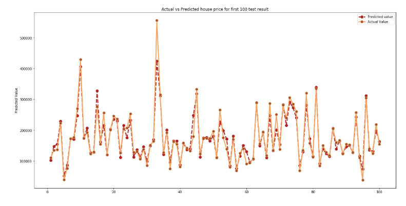

# Ames-Real-Estate
In this project, we trained a model to predict the House Prices for House in the city of Ames in Iowa, Based on features about the house and its surroundings.The data set was obtained from the Kaggle Website which contains over 70 attributes containing numerical and categorical data.

The model was build based on initially statistical and EDA Analysis and thereby creating new features as well as feature transformation to obtain normal distribution. Lastly we build several individual regression models such as Linear, Ridge, Lasso, Random Forest, Gradient Boost and AdaBoost, Gradient Boost, LGB and XGBoost. Final result was obtained by 'Stacking' approach.

The key takeaway from the EDA and Modeling were
* Most important factors for house price are Total Area, Quality and Age of a house.
* Having additional features like Garage, Porch, air conditioning and having bigger living area will increase the price of the house.

Below figure shows the first 100 Result of our model predictions on the test data set.

